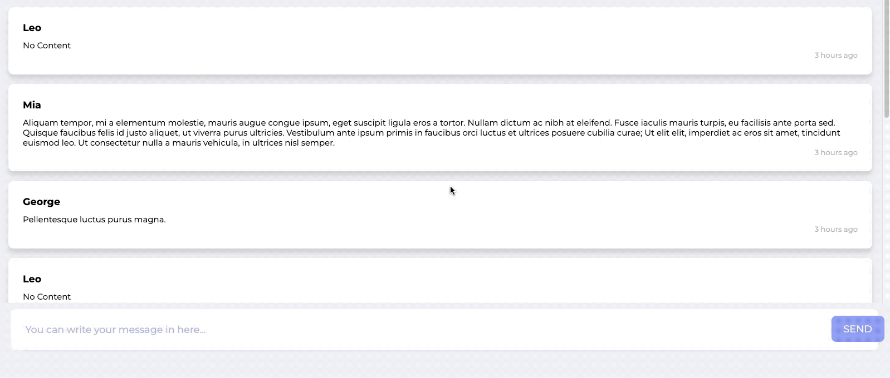

![Built With Stencil](https://img.shields.io/badge/-Built%20With%20Stencil-16161d.svg?logo=data%3Aimage%2Fsvg%2Bxml%3Bbase64%2CPD94bWwgdmVyc2lvbj0iMS4wIiBlbmNvZGluZz0idXRmLTgiPz4KPCEtLSBHZW5lcmF0b3I6IEFkb2JlIElsbHVzdHJhdG9yIDE5LjIuMSwgU1ZHIEV4cG9ydCBQbHVnLUluIC4gU1ZHIFZlcnNpb246IDYuMDAgQnVpbGQgMCkgIC0tPgo8c3ZnIHZlcnNpb249IjEuMSIgaWQ9IkxheWVyXzEiIHhtbG5zPSJodHRwOi8vd3d3LnczLm9yZy8yMDAwL3N2ZyIgeG1sbnM6eGxpbms9Imh0dHA6Ly93d3cudzMub3JnLzE5OTkveGxpbmsiIHg9IjBweCIgeT0iMHB4IgoJIHZpZXdCb3g9IjAgMCA1MTIgNTEyIiBzdHlsZT0iZW5hYmxlLWJhY2tncm91bmQ6bmV3IDAgMCA1MTIgNTEyOyIgeG1sOnNwYWNlPSJwcmVzZXJ2ZSI%2BCjxzdHlsZSB0eXBlPSJ0ZXh0L2NzcyI%2BCgkuc3Qwe2ZpbGw6I0ZGRkZGRjt9Cjwvc3R5bGU%2BCjxwYXRoIGNsYXNzPSJzdDAiIGQ9Ik00MjQuNywzNzMuOWMwLDM3LjYtNTUuMSw2OC42LTkyLjcsNjguNkgxODAuNGMtMzcuOSwwLTkyLjctMzAuNy05Mi43LTY4LjZ2LTMuNmgzMzYuOVYzNzMuOXoiLz4KPHBhdGggY2xhc3M9InN0MCIgZD0iTTQyNC43LDI5Mi4xSDE4MC40Yy0zNy42LDAtOTIuNy0zMS05Mi43LTY4LjZ2LTMuNkgzMzJjMzcuNiwwLDkyLjcsMzEsOTIuNyw2OC42VjI5Mi4xeiIvPgo8cGF0aCBjbGFzcz0ic3QwIiBkPSJNNDI0LjcsMTQxLjdIODcuN3YtMy42YzAtMzcuNiw1NC44LTY4LjYsOTIuNy02OC42SDMzMmMzNy45LDAsOTIuNywzMC43LDkyLjcsNjguNlYxNDEuN3oiLz4KPC9zdmc%2BCg%3D%3D&colorA=16161d&style=for-the-badge)


[](https://github.com/Paraboly/pwc-chat)

[](https://www.npmjs.com/package/@paraboly/pwc-chat)
[](https://www.npmjs.com/package/@paraboly/pwc-chat)

[](https://opensource.org/licenses/MIT)

<p align="center">
  
  

</p>

<!-- ## [Live Codepen Example](https://codepen.io/wrathchaos/pen/dyyvRzM) -->

## Installation

### Script tag

- Put two script tags similar to this in the head of your index.html:

```html
<script
  type="module"
  src="https://unpkg.com/@paraboly/pwc-chat@latest/dist/pwc-chat/pwc-chat.esm.js"
></script>
<script
  nomodule
  src="https://unpkg.com/@paraboly/pwc-chat@latest/dist/pwc-chat/pwc-chat.js"
></script>
```

- Then you can use the element anywhere in your template, JSX, html etc

### Node Modules

- Run `npm install @paraboly/pwc-chat`
- Put a script tag similar to this `<script src='node_modules/@paraboly/pwc-chat/dist/pwc-chat.js'></script>` in the head of your index.html
- Then you can use the element anywhere in your template, JSX, html etc

### In a stencil-starter app

- Run `npm install @paraboly/pwc-chat`
- Add an import to the npm packages `import @paraboly/pwc-chat;`
- Then you can use the element anywhere in your template, JSX, html etc

# Usage

## Basic Usage

Message List should be this format:

```json
[
  { username: "", message: "" },
];
```

#### Here is the example

```jsx
<pwc-chat
  changeMessage={text => console.log("onChangeMessage: ", text)}
  submitMessage={fullText => console.log("onSubmit: ", fullText)}
  messageList={[
    {
      username: "Leo",
      message: "No Content",
      time: "3 hours ago"
    },
    {
      username: "Mia",
      message:
        "Aliquam tempor, mi a elementum molestie, mauris augue congue ipsum, eget suscipit ligula eros a tortor. Nullam dictum ac nibh at eleifend. Fusce iaculis mauris turpis, eu facilisis ante porta sed. Quisque faucibus felis id justo aliquet, ut viverra purus ultricies. Vestibulum ante ipsum primis in faucibus orci luctus et ultrices posuere cubilia curae; Ut elit elit, imperdiet ac eros sit amet, tincidunt euismod leo. Ut consectetur nulla a mauris vehicula, in ultrices nisl semper.",
      time: "1 hour ago"
    },
    {
      username: "George",
      message: "Pellentesque luctus purus magna.",
      time: ""
    },
    {
      username: "Leo",
      message: "No Content",
      time: "3 weeks ago"
    }
  ]}
></pwc-chat>
```

## Checkbox onCheckChange Listener Usage

### JS Way

This is just an example from pwc-chat, you need to change it!

```js
// onChangeMessage
const pwcChat = document.querySelector("pwc-chat");
pwcChat.addEventListener("changeMessage", text => {
  console.log("Chat Text: ", text);
});
// onSubmitMessage
pwcChat.addEventListener("submitMessage", fullText => {
  console.log("Chat onSubmit: ", fullText);
});
```

## Future Plans

- [x] ~~Documentation~~
- [x] ~~LICENSE~~

## Authors

FreakyCoder, kurayogun@gmail.com | kuray.ogun@paraboly.com

## License

WebComponent PWC Chat is available under the MIT license.

See the LICENSE file for more info.
