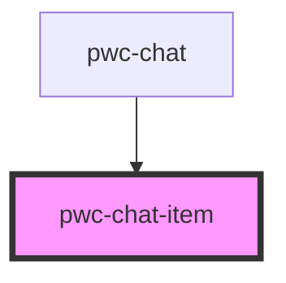

# pwc-chat-item

<!-- Auto Generated Below -->

## Properties

| Property                   | Attribute            | Description | Type                              | Default     |
| -------------------------- | -------------------- | ----------- | --------------------------------- | ----------- |
| `cancelButtonName`         | `cancel-button-name` |             | `string`                          | `undefined` |
| `createdLabelNameProducer` | --                   |             | `(createdDate: string) => string` | `undefined` |
| `deletable`                | `deletable`          |             | `boolean`                         | `undefined` |
| `deleteButtonName`         | `delete-button-name` |             | `string`                          | `undefined` |
| `editButtonName`           | `edit-button-name`   |             | `string`                          | `undefined` |
| `editTime`                 | `edit-time`          |             | `string`                          | `undefined` |
| `editable`                 | `editable`           |             | `boolean`                         | `undefined` |
| `editedLabelNameProducer`  | --                   |             | `(editedDate: string) => string`  | `undefined` |
| `message`                  | `message`            |             | `string`                          | `undefined` |
| `messageId`                | `message-id`         |             | `string`                          | `undefined` |
| `saveButtonName`           | `save-button-name`   |             | `string`                          | `undefined` |
| `time`                     | `time`               |             | `string`                          | `undefined` |
| `username`                 | `username`           |             | `string`                          | `undefined` |

## Events

| Event            | Description | Type                                                      |
| ---------------- | ----------- | --------------------------------------------------------- |
| `messageDeleted` |             | `CustomEvent<{ messageId: string; }>`                     |
| `messageEdited`  |             | `CustomEvent<{ messageId: string; newMessage: string; }>` |

## Dependencies

### Used by

 - [pwc-chat](../pwc-chat)

### Graph

----------------------------------------------

*Built with [StencilJS](https://stenciljs.com/)*
