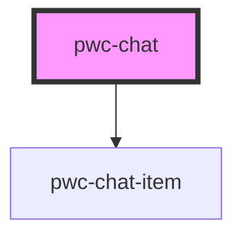

# component-name

<!-- Auto Generated Below -->

## Properties

| Property                   | Attribute                   | Description | Type                              | Default                                   |
| -------------------------- | --------------------------- | ----------- | --------------------------------- | ----------------------------------------- |
| `cancelButtonName`         | `cancel-button-name`        |             | `string`                          | `"Cancel"`                                |
| `createdLabelNameProducer` | --                          |             | `(createdDate: string) => string` | `(date) => `Created ${date}``             |
| `deleteButtonName`         | `delete-button-name`        |             | `string`                          | `"Delete"`                                |
| `editButtonName`           | `edit-button-name`          |             | `string`                          | `"Edit"`                                  |
| `editedLabelNameProducer`  | --                          |             | `(editedDate: string) => string`  | `(date) => `Edited ${date}``              |
| `fullMessage`              | `full-message`              |             | `string`                          | `null`                                    |
| `inputValue`               | `input-value`               |             | `any`                             | `""`                                      |
| `listContainerId`          | `list-container-id`         |             | `string`                          | `"list-container-id"`                     |
| `messageList`              | --                          |             | `IMessageItem[]`                  | `[]`                                      |
| `saveButtonName`           | `save-button-name`          |             | `string`                          | `"Save"`                                  |
| `submitButtonName`         | `submit-button-name`        |             | `string`                          | `"Send"`                                  |
| `submitButtonPlaceholder`  | `submit-button-placeholder` |             | `string`                          | `"You can write your message in here..."` |

## Events

| Event           | Description                    | Type               |
| --------------- | ------------------------------ | ------------------ |
| `changeMessage` | onChange method for text input | `CustomEvent<any>` |
| `submitMessage` | onSubmit method for text input | `CustomEvent<any>` |

## Dependencies

### Depends on

- [pwc-chat-item](../pwc-chat-item)

### Graph

----------------------------------------------

*Built with [StencilJS](https://stenciljs.com/)*
